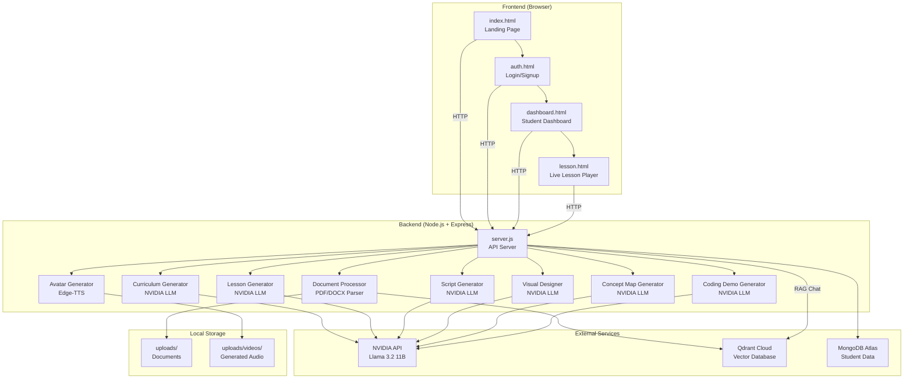
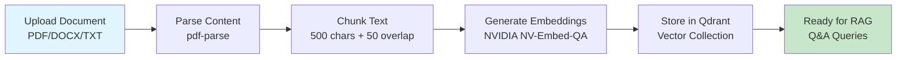
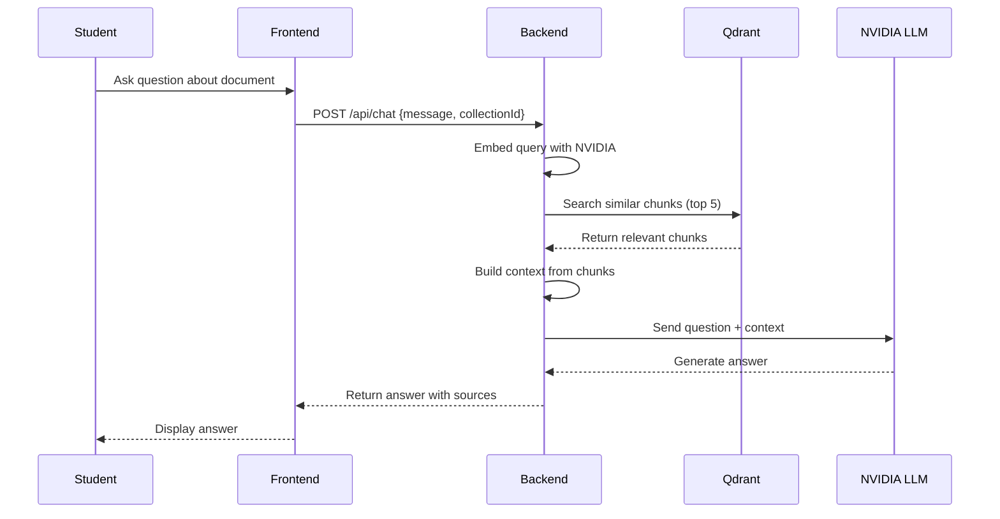
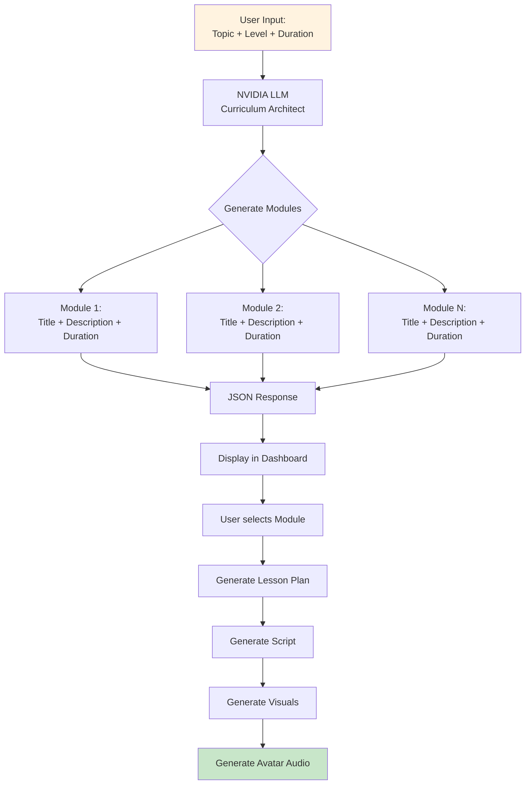
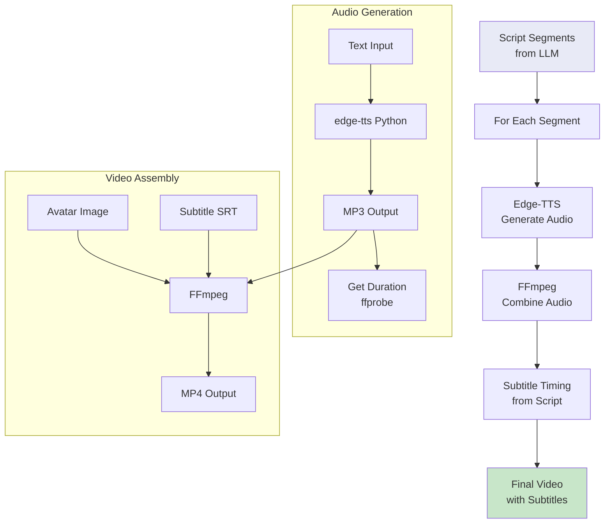
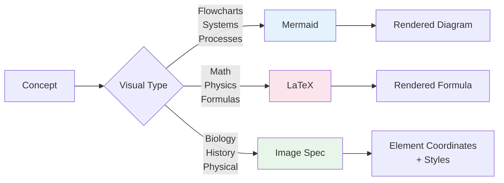
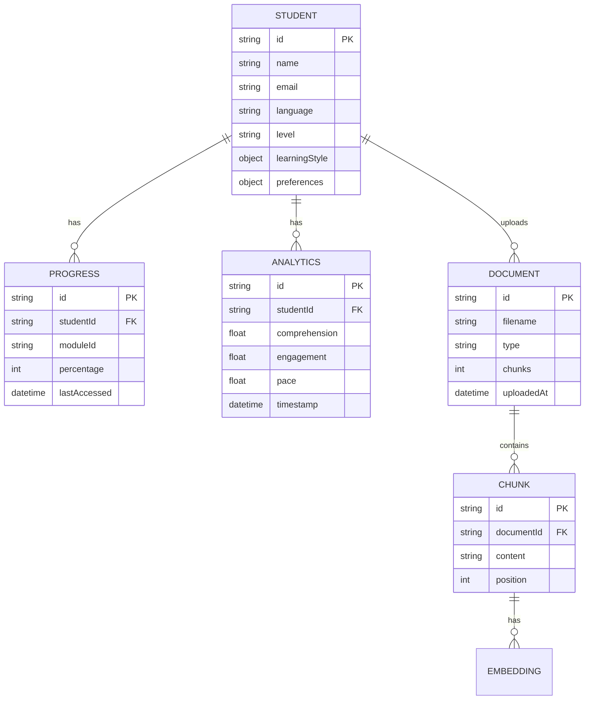
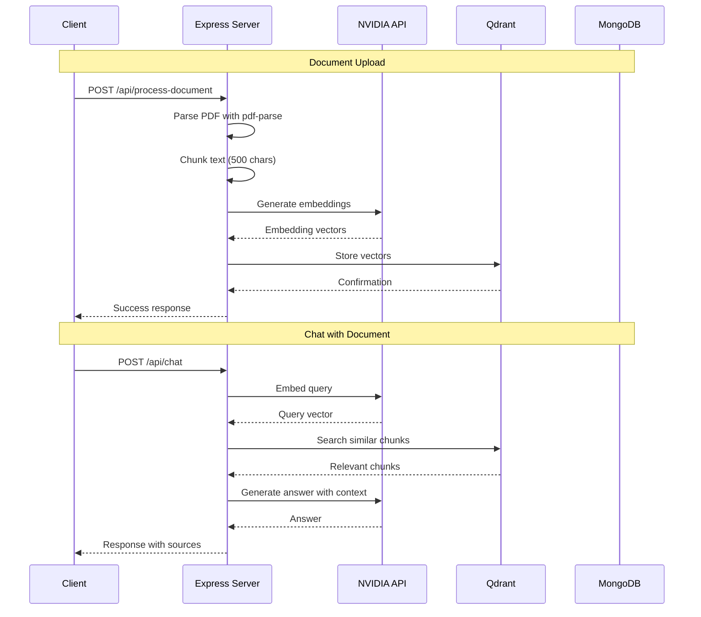
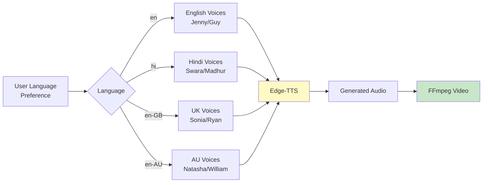
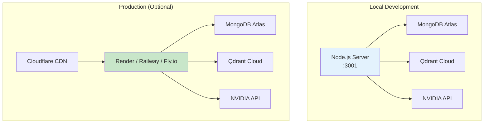

# EduAvatar Architecture

## System Architecture Overview

---

## Document Processing Pipeline

---

## RAG (Retrieval-Augmented Generation) Flow

---

## Curriculum Generation Flow

---

## Avatar Video Generation Pipeline

---

## Visual Types

---

## Data Storage Architecture

---

## API Request Flow

---

## Multi-Language Support

---

## Deployment Architecture

---

## Technology Decisions

| Choice | Why |
|--------|-----|
| **NVIDIA API (free)** | No cost, supports Llama 3.2, fast inference |
| **Qdrant Cloud (free)** | Managed vector DB, easy setup, good free tier |
| **MongoDB Atlas (free)** | Flexible schema for student data, free M0 tier |
| **Edge-TTS (free)** | Microsoft voices, no API key, high quality |
| **FFmpeg (free)** | Industry standard, reliable, works everywhere |
| **Vanilla JS (no framework)** | Zero build step, fast loading, simple deployment |
| **Express.js** | Minimal, fast, perfect for API server |
| **pdf-parse** | Pure JS, no native deps, works everywhere |
